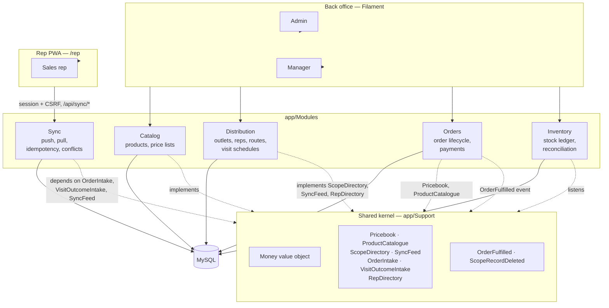

# Architecture overview

The short version: a modular monolith in Laravel, four business modules plus a fifth for sync, none of them importing each other's models, talking through a small shared kernel where they genuinely need to. This document is the map. The reasoning behind each boundary lives in the ADRs it links to.

## The shape of it

The dotted lines are the point. A solid arrow into the shared kernel would mean one module importing another's model, and a Pest architecture test (`tests/Arch/ArchTest.php`) fails the build if that ever happens. The dotted lines are interfaces: a module implements one, another module depends on it, and neither one knows the other exists. [ADR-001](adr/0001-module-boundaries.md) is the decision behind this; the rest of this document is what it looks like once four phases of code sit on top of it.

## The modules

- **Catalog** — products, units of measure, price lists with effective dates, and the precedence logic that decides which list prices a given sale (customer-specific, then route-specific, then the house default).
- **Distribution** — outlets, sales reps, routes, visit schedules, and now visit outcomes (what actually happened on a call — an order, or a no-sale with a reason).
- **Orders** — the order lifecycle (draft → submitted → approved → fulfilled → cancelled, each transition guarded and none of them silently failing), order lines that snapshot the product's details at the time of sale, and cash/credit payment records.
- **Inventory** — stock as an append-only ledger rather than a number that gets edited, warehouses, van loads, and end-of-day reconciliation. [ADR-006](adr/0006-stock-ledger.md) is the append-only reasoning.
- **Sync** — the offline sync contract: idempotent push, cursor-based delta pull, per-rep pricing, conflict detection. Depends on nothing but the shared kernel — [ADR-002](adr/0002-offline-sync-strategy.md) is the whole design.

Each module owns its own migrations, models, factories, and Filament resources. A `BackOfficePolicy` is shared across all of them, because the access rule (admins and managers can write, reps read only) is identical everywhere it applies — sharing a policy is not the same as sharing a model, and nothing about it lets one module read another's data.

## The shared kernel

`app/Support/` is deliberately small: a `Money` value object ([ADR-004](adr/0004-money-handling.md)), two domain events, and a handful of interfaces. Every interface follows the same shape — a "composite" that modules register an implementation into during boot, so the consuming side depends on one thing that happens to be made of several:

| Contract | Registers into | Answers |
|---|---|---|
| `ScopeDirectory` | `CompositeScopeDirectory` | "What is record #12 in Distribution called?" — for a dropdown in a Catalog form, without Catalog reading a `Customer` model. |
| `Pricebook` | (bound directly to `PriceResolver`) | "What does this customer pay for this product, on this date?" |
| `ProductCatalogue` | (bound directly to `CatalogProducts`) | "What are this product's sku, name and unit?" — for Orders to snapshot onto a line. |
| `SyncFeed` | `CompositeSyncFeed` | "What changed for entity type X, since this cursor, for this rep?" |
| `OrderIntake` / `VisitOutcomeIntake` | (bound directly) | Sync's one door into Orders and Distribution respectively — the only way a pushed payload becomes a real row. |
| `RepDirectory` | (bound directly to `DistributionReps`) | "Which rep is this user?" and "does this rep cover this customer?" |

Two domain events cross module lines the same way: `OrderFulfilled` (Orders announces it, Inventory listens and writes the stock movements) and `ScopeRecordDeleted` (Distribution announces a hard delete, Catalog cleans up any price list assignments that pointed at it).

## The rep PWA

`/rep` is not a module — it lives at the app level (`app/Http/Controllers/Rep`), the same way the cross-module Filament dashboard widgets do, because reading across Distribution, Catalog and Orders is exactly the kind of knowledge a module is not allowed to hold. It renders once, then hands off entirely to a hand-written service worker, an IndexedDB layer, and an Alpine.js capture flow — no server round-trip per interaction, because a Livewire component is a brick the moment the network drops. The full design, including why that had to be true, is in the [sync deep dive](sync-deep-dive.md).

## Quality gates

Three things run on every push and block a merge if any of them fail: `pint` (formatting), `phpstan` at level 6 (static analysis), and the Pest suite — twice, once against SQLite and once against MySQL, because the stock ledger's invariants are transaction and constraint behaviour, which is exactly where the two databases diverge. A second, hand-written test suite (`tests/Arch/ModuleBoundaryTest.php`) reads the actual source files to catch what Pest's arch rules structurally can't see: a class named in a string, a migration's foreign key into another module's table, a raw query bypassing the model layer entirely.
