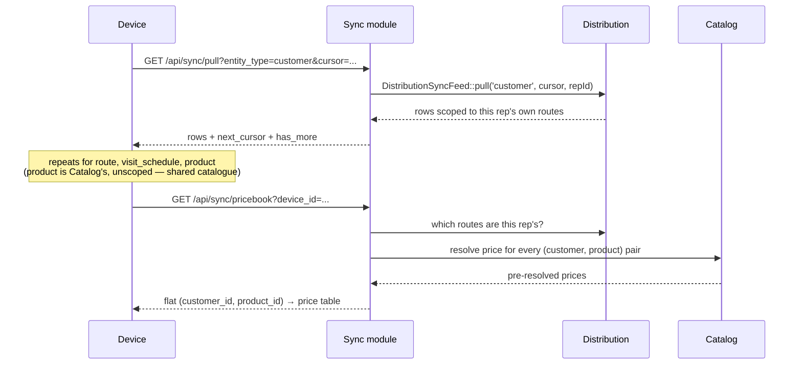
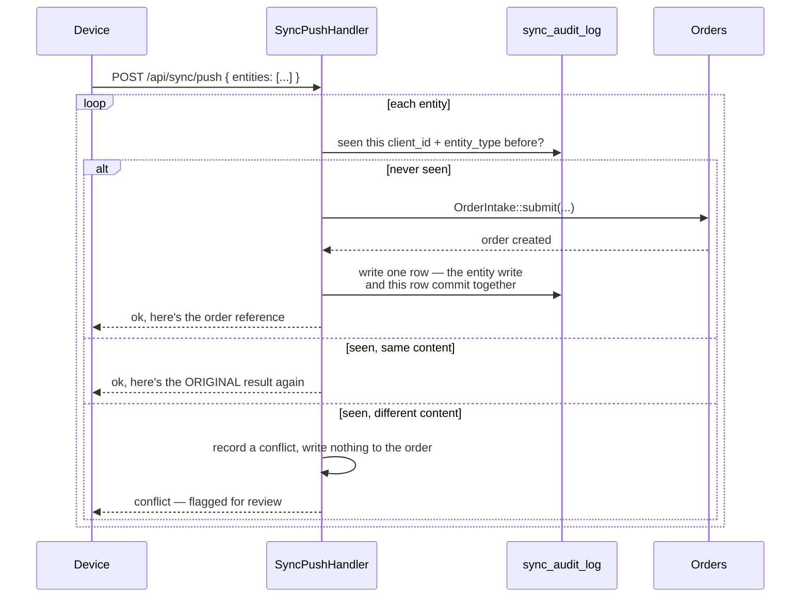

# The sync deep dive

[ADR-002](adr/0002-offline-sync-strategy.md) is the decision record — every choice, and the alternative it beat. This is the other kind of document: what actually happens, in order, when a rep's phone goes from a dead connection to a synced one. If you only read one doc to understand this project, read this one.

## The problem, concretely

A rep starts the day with a phone, walks a route of outlets, and the connection comes and goes the whole time — sometimes a full bar, sometimes nothing for an hour. They still need to see today's round, know what an outlet pays for each product, capture an order or note that nobody was buying, and trust that none of it gets lost or duplicated once they're back in signal. That's the whole job. Everything below is in service of it.

## The morning: pulling the round

Before a rep can capture anything, their phone needs the day's data sitting locally. On login (or any time the app is open with a connection), the PWA pulls four kinds of thing:

Two things worth noticing. First, everything but the product catalogue is scoped to the requesting rep — a device pulling customers gets its own ~20 outlets, not the whole distributor's book, because a phone is something that gets lost, and the blast radius of losing one should be one rep's round, not the company's entire customer list. Second, pricing arrives pre-resolved. The rules for which price list wins — customer beats route beats the house default, ties broken by which list is newer — are the most-corrected logic in the whole project, and a second implementation of them in JavaScript, running on a device that can't be patched mid-route, is exactly the kind of thing that quietly drifts out of sync with the real rules. So the device never runs them. It gets a flat table and does a lookup.

The pull is a delta, not a full refresh, past the first time. Every entity type has its own cursor — a `(timestamp, id)` pair rather than a bare timestamp, because a bare timestamp drops a row when two records change in the same second and the query can only ask for strictly-after. The device stores each cursor and hands it back next time, so a rep who's already pulled today only pulls what changed since.

## In the field: capturing without asking permission

This is the part that breaks a lot of offline designs: the capture screens cannot make a server round-trip per tap, because there might not be a server to trip to. So the entire route → visit → capture flow is Alpine.js reading and writing IndexedDB directly. Opening a customer, adding a product to a cart, changing a quantity, recording a no-sale — none of it touches the network. A Livewire component, which is built around exactly that round-trip, would be a brick the instant signal dropped.

Capturing something (an order, a no-sale) does two things locally: it writes the record to an IndexedDB `queue` store, keyed by a client-generated ULID, and it marks the outlet visited for the day in a separate, date-scoped record — separate, because "visited" can't be read off the queue itself. The whole point of a successful sync is that the item *leaves* the queue, and a check that only looked at the queue would watch the checkmark disappear the moment the sync it was celebrating actually worked.

## Reconnecting: the push

When the phone finds signal again — the browser's `online` event fires, a periodic timer ticks, or the rep hits the manual sync button — the queue drains:

The `sync_audit_log` table is doing two jobs at once: it's the audit trail ADR-002 requires, and it's the entire idempotency mechanism, because a row that already exists for a given `(client_id, entity_type)` *is* the record of "this was already handled." That's what makes resubmission safe. A phone that pushes an order, loses the response to a dropped connection, and pushes the exact same order again on its next attempt gets told "yes, already done, here's what happened" instead of creating a second order. The entity write and that audit row land in one transaction — a version of this without that guarantee shipped briefly and a strict review caught it: a crash in the gap between the two writes left an order that existed with no way to ever successfully resubmit its id, which is precisely the kind of stuck state that would push a rep to just re-key the sale and create a real duplicate.

A conflict is the one case idempotency alone can't resolve: the same client-generated id, but different content. That can only mean the id got reused for something else, and there's no principled way to guess which version is right — so nothing is guessed. The mismatch is logged, and it surfaces for a human to look at. This is also why the design keeps a hard rule that makes conflicts rare in the first place: **once an order has synced, it's read-only from the device's side.** Any correction happens in the back office, through the same guarded actions a manager would use anyway. There is no "edit a synced order and push the edit" pathway to reconcile, because there's no such pathway at all.

Price integrity works on the same "trust, then check" principle as everything else. The device echoes back the price and price-list id it used when the rep rang up the sale. The server re-resolves that same lookup — as of the moment the order was placed, not the moment it happened to sync — and compares. Agreement: nothing more to do. Disagreement, because a price changed under the rep's feet while they were offline: the order keeps the rep's price (the sale already happened at that number; repricing it after the fact would just be a different kind of lie) and gets flagged for a manager to glance at.

## What this design doesn't try to do

Named plainly, because a gap that's written down is a decision and a gap that isn't is a bug waiting to be found:

- **No line-level sync.** An offline order arrives as one whole document — the order and every line together. There's no partial-order sync in v1.
- **No two-sided merge.** The read-only-once-synced rule above is what makes this possible to skip; there's no scenario where the client and the server both hold a legitimate, divergent edit to the same order that needs reconciling.
- **No promise about a route reassigned mid-flight.** A device's pull is scoped to its rep's *current* routes. If a route moves to a different rep, the old rep's device simply stops seeing it in future deltas — it isn't told to drop what it already cached. The same shape of gap applies to a customer hard-deleted in the back office. Both are accepted, narrow, and documented rather than silently missing.
- **No dependence on the Background Sync API.** It's Chromium-only, so it's a bonus where the browser offers it, never the only way the queue drains — the app-open pull, the `online` event, a periodic timer, and the manual button are the real mechanism, and any one of them alone is enough.
